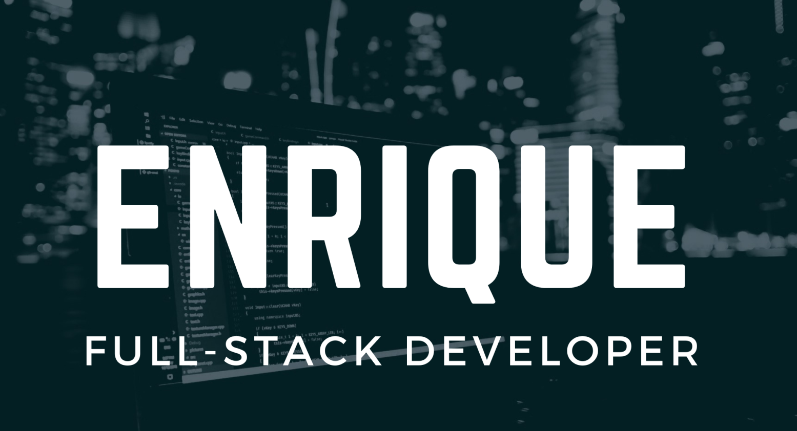

# Hello! 👋

My name is Enrique, and I made a career change from industrial engineering to web and software development during the pandemic. I build and improve full stack applications, including mobile apps using Flutter! I'm working as a freelancer while I look for a full time position, so reach out to me on [LinkedIn](https://www.linkedin.com/in/ehilst/) with any opportunities!

 
<strong>My details</strong>

 <ul>
  <li> 🔭 I’m currently working on freelance projects </li>
  <li> 🌱 I’m currently learning Flutter </li>
  <li>👯 I’m looking to collaborate on open source .NET or JavaScript based projects </li>
  <li> 💬 Ask me about anything! </li>
  <li> 📫 How to reach me: Message me on <a href="https://www.linkedin.com/in/ehilst/">LinkedIn</a> </li>
  <li> 😄 Pronouns: he/him </li>
  <li> ⚡ Fun fact: I was an industrial engineer before making a career change </li>
 </ul>

 

## Projects

## Skills

More Skills

 

